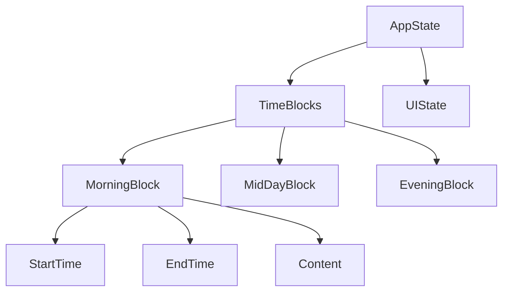
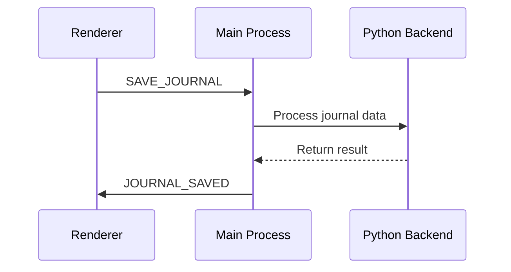

# Electron Desktop Application Migration Design

## 1. Overview

This document outlines the design for migrating the existing Tkinter-based Daily Task Journal application to a modern Electron desktop application. The migration aims to provide a more customizable, scalable, and visually appealing user interface while maintaining all existing functionality.

### 1.1 Current System Analysis
- **Framework**: Python with Tkinter GUI
- **Core Features**: 
  - Time block management (Morning, Mid-day, Evening)
  - Time tracking with start/end times
  - Data persistence in JSON format
  - Dark-themed UI
- **Data Storage**: Hierarchical folder structure with JSON files
- **Backend**: Python-based data processing and storage

### 1.2 Migration Goals
- Modern, customizable UI with web technologies
- Cross-platform compatibility (Windows, macOS, Linux)
- Enhanced user experience with responsive design
- Maintain all existing functionality
- Improved scalability for future features

## 2. Architecture

### 2.1 High-Level Architecture
```
┌─────────────────────────────────────────────────────────────┐
│                    Electron Main Process                    │
├─────────────────────────────────────────────────────────────┤
│  ┌──────────────────┐    ┌──────────────────────────────┐  │
│  │   Node.js API    │◄──►│      Python Backend          │  │
│  │ (IPC Handling)   │    │ (Data Processing & Storage)  │  │
│  └──────────────────┘    └──────────────────────────────┘  │
└─────────▲──────────────────────────────────────────────────┘
          │
          ▼
┌─────────────────────────────────────────────────────────────┐
│                   Electron Renderer Process                 │
│                                                             │
│  ┌──────────────┐  ┌──────────────┐  ┌───────────────────┐  │
│  │   React UI   │  │  CSS/SCSS    │  │  HTML Templates   │  │
│  │ (Components) │  │ (Styling)    │  │  (Structure)      │  │
│  └──────────────┘  └──────────────┘  └───────────────────┘  │
└─────────────────────────────────────────────────────────────┘
```

### 2.2 Component Architecture

#### 2.2.1 Electron Main Process
- **Responsibilities**:
  - Application lifecycle management
  - Window creation and management
  - Inter-process communication (IPC) handling
  - System integration (menus, notifications)
  - Python subprocess management

#### 2.2.2 Python Backend Service
- **Responsibilities**:
  - Data processing (TimeBlock model)
  - File I/O operations (JSON serialization)
  - Journal data management
  - Business logic implementation
  - External library integration

#### 2.2.3 Renderer Process (Frontend)
- **Responsibilities**:
  - User interface rendering
  - User interaction handling
  - State management
  - Communication with main process via IPC

## 3. Frontend Architecture

### 3.1 Technology Stack
- **Framework**: React 18+
- **State Management**: Redux Toolkit
- **Styling**: Sass/SCSS with modular approach
- **Build Tool**: Vite
- **UI Components**: Custom components with Material Design inspiration
- **Icons**: React Icons library

### 3.2 Component Hierarchy
```
App
├── Header
├── TimeBlockContainer
│   ├── TimeBlock (Morning)
│   │   ├── TimeInput (Start)
│   │   ├── TimeInput (End)
│   │   └── TaskEditor
│   ├── TimeBlock (Mid-day)
│   │   ├── TimeInput (Start)
│   │   ├── TimeInput (End)
│   │   └── TaskEditor
│   └── TimeBlock (Evening)
│       ├── TimeInput (Start)
│       ├── TimeInput (End)
│       └── TaskEditor
├── ActionButtons
└── StatusBar
```

### 3.3 Component Specifications

#### 3.3.1 TimeBlock Component
- **Props**:
  - `blockName`: String identifier (Morning, Mid-day, Evening)
  - `startTime`: String in HH:MM format
  - `endTime`: String in HH:MM format
  - `content`: String content of tasks
  - `onStartTimeChange`: Function handler
  - `onEndTimeChange`: Function handler
  - `onContentChange`: Function handler
- **State Management**:
  - Local state for form inputs
  - Redux store synchronization

#### 3.3.2 TaskEditor Component
- **Features**:
  - Multi-line text editing
  - Placeholder text handling
  - Auto-resizing based on content
  - Keyboard shortcuts

### 3.4 State Management


## 4. Backend Architecture

### 4.1 Python Backend Service
The existing Python backend will be preserved with minor modifications to support IPC communication.

#### 4.1.1 Core Modules
- **JournalProcessor**: Main processing logic
- **JournalDataManager**: Data persistence and retrieval
- **TimeBlock Model**: Data structure for time blocks
- **Utilities**: Helper functions for formatting and validation

#### 4.1.2 API Interface
```python
# IPC message handlers
def handle_save_journal(data):
    # Process and save journal entries
    pass

def handle_load_journal(date):
    # Load journal entries for a specific date
    pass

def handle_clear_journal():
    # Clear current journal entries
    pass
```

### 4.2 Data Models

#### 4.2.1 TimeBlock Model
```python
@dataclass
class TimeBlock:
    block_name: str
    start_time: str
    end_time: str
    content: str
    date: datetime = datetime.now()
```

#### 4.2.2 JSON Storage Format
```json
{
  "date": "2025-02-15",
  "blocks": [
    {
      "block_name": "Morning Tasks",
      "start_time": "08:00",
      "end_time": "12:00",
      "content": "Task content",
      "date": "2025-02-15T08:00:00"
    }
  ],
  "last_updated": "2025-02-15T08:00:00"
}
```

## 5. IPC Communication Layer

### 5.1 Message Types
| Message Type | Direction | Payload | Description |
|--------------|-----------|---------|-------------|
| SAVE_JOURNAL | Renderer → Main | Journal data | Save current journal entries |
| LOAD_JOURNAL | Renderer → Main | Date string | Load journal for specific date |
| CLEAR_JOURNAL | Renderer → Main | None | Clear current journal entries |
| JOURNAL_SAVED | Main → Renderer | Success status | Confirmation of save operation |
| JOURNAL_LOADED | Main → Renderer | Journal data | Return loaded journal data |

### 5.2 Communication Flow


## 6. Data Flow Between Layers

### 6.1 Save Operation Flow
1. User clicks "Save Journal" button
2. React component collects data from all TimeBlock components
3. Data is sent via IPC to main process
4. Main process forwards data to Python backend
5. Python backend processes and saves data to JSON files
6. Success/failure status is returned to renderer

### 6.2 Load Operation Flow
1. Application starts or user requests specific date
2. Renderer sends LOAD_JOURNAL message with date
3. Main process requests data from Python backend
4. Python backend loads and processes JSON data
5. Data is sent back to renderer
6. React components update with loaded data

## 7. UI/UX Design

### 7.1 Visual Design
- **Theme**: Dark mode with customizable accent colors
- **Layout**: Responsive grid system
- **Typography**: Modern, readable fonts
- **Icons**: Consistent icon set for actions

### 7.2 User Interface Components

#### 7.2.1 Time Input Controls
- Custom time picker components
- Input validation for time format
- Keyboard navigation support

#### 7.2.2 Task Editor
- Rich text editing capabilities
- Auto-resizing text areas
- Placeholder text handling

#### 7.2.3 Action Buttons
- Primary action: Save Journal
- Secondary action: Clear All
- Visual feedback on actions

### 7.3 Responsive Design
- Adapts to different window sizes
- Maintains usability on smaller screens
- Consistent experience across platforms

## 8. Project Structure

### 8.1 Directory Layout
```
electron-task-journal/
├── main/                    # Electron main process
│   ├── main.js             # Main process entry point
│   ├── ipc-handlers.js     # IPC message handlers
│   └── python-bridge.js    # Python subprocess management
├── renderer/               # Frontend application
│   ├── src/
│   │   ├── components/     # React components
│   │   ├── store/          # Redux store
│   │   ├── styles/         # SCSS stylesheets
│   │   └── utils/          # Utility functions
│   └── index.html          # Main HTML file
├── backend/                # Python backend (existing code)
│   ├── day_logger/         # Core modules
│   ├── task_journal.py     # Entry point
│   └── requirements.txt    # Dependencies
├── assets/                 # Static assets
├── tests/                  # Test files
├── package.json            # Node.js dependencies
└── electron-builder.json   # Build configuration
```

## 9. Environment Setup

### 9.1 Development Environment
- **Node.js**: v18+ with npm/yarn
- **Python**: 3.12+ with virtual environment
- **IDE**: VS Code with recommended extensions
- **Build Tools**: Electron Forge or electron-builder

### 9.2 Dependency Management
- **Frontend**: npm/yarn for JavaScript dependencies
- **Backend**: pip/poetry for Python dependencies
- **Cross-platform**: Electron for desktop packaging

### 9.3 Virtual Environment Setup
```bash
# Create Python virtual environment
python -m venv .venv
source .venv/bin/activate  # Linux/macOS
.venv\Scripts\activate     # Windows

# Install Python dependencies
pip install -r requirements.txt
```

## 10. Build and Deployment

### 10.1 Build Process
1. Bundle React application with Vite
2. Package Electron application with electron-builder
3. Include Python runtime and dependencies
4. Generate platform-specific installers

### 10.2 Deployment Targets
- Windows (NSIS installer)
- macOS (DMG image)
- Linux (AppImage/Debian package)

## 11. Testing Strategy

### 11.1 Frontend Testing
- **Unit Tests**: Jest for React components
- **Integration Tests**: Testing component interactions
- **E2E Tests**: Playwright/Cypress for user flows

### 11.2 Backend Testing
- **Unit Tests**: Pytest for Python modules
- **Integration Tests**: Testing IPC communication
- **Data Persistence**: Validation of JSON file operations

### 11.3 Cross-Platform Testing
- Test on Windows, macOS, and Linux
- Verify UI consistency across platforms
- Validate data persistence across platforms

## 12. Security Considerations

### 12.1 Data Security
- Validate all IPC messages
- Sanitize user input
- Secure file system access

### 12.2 Application Security
- Use Electron's context isolation
- Disable nodeIntegration in renderer
- Implement Content Security Policy

## 13. Performance Optimization

### 13.1 Frontend Optimization
- Code splitting for faster initial load
- Efficient React component rendering
- Memoization of expensive operations

### 13.2 Backend Optimization
- Efficient JSON processing
- Optimized file I/O operations
- Caching of frequently accessed data

## 14. Future Extensibility

### 14.1 Planned Features
- Statistics and reporting dashboard
- Export functionality (PDF, CSV)
- Cloud synchronization
- Custom time blocks
- Task categorization

### 14.2 Extension Points
- Plugin architecture for additional features
- Theme customization system
- API for third-party integrations