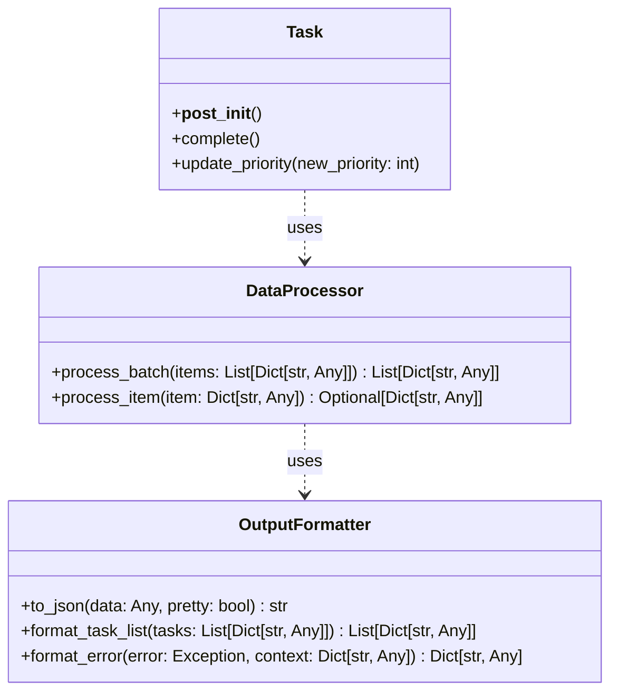
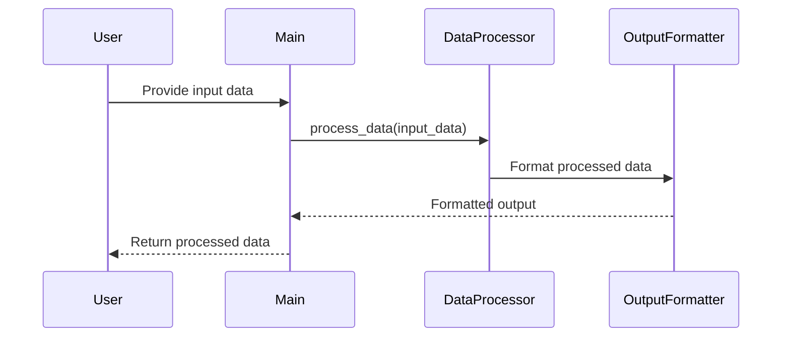
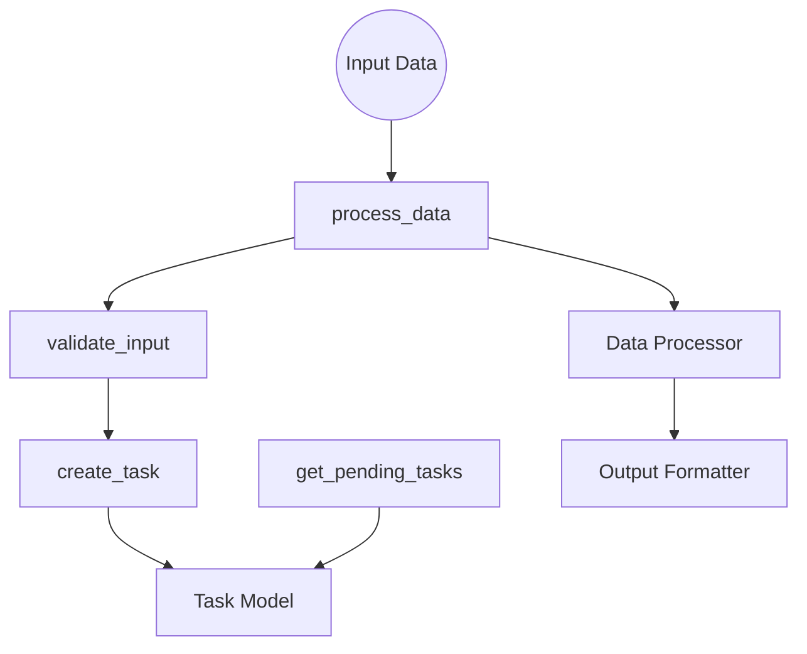

# Technical Analysis and Documentation

## Overview

This document provides a comprehensive analysis of the task management application, detailing the main loop, data processing, and interactions between various modules.

## Main Module (`main.py`)

The main module contains core functions for processing data, validating input, creating tasks, and retrieving pending tasks. It integrates with other modules like `Task`, `DataProcessor`, and `OutputFormatter`.

### Functions

1. **`process_data`**: Processes incoming data and transforms it according to business rules.
2. **`validate_input`**: Validates input data against a required schema.
3. **`create_task`**: Creates a new task with specified attributes.
4. **`get_pending_tasks`**: Retrieves all tasks that have not been completed.

## Models (`models/task.py`)

Defines the `Task` class, representing a task with attributes like title, description, due date, and priority. Includes methods for task completion and priority updates.

## Processors (`processors/data_processor.py`)

Contains the `DataProcessor` class responsible for processing and transforming input data. Provides methods for processing individual items and batches of items.

## Utilities (`utils/`)

- **`formatters.py`**: Contains the `OutputFormatter` class for formatting data and error messages.
- **`helpers.py`**: Provides utility functions for configuration loading, batching, date validation, and input sanitization.

## Tests (`tests/`)

- **`test_main.py`**: Contains unit tests for the main module functions.
- **`test_task.py`**: Contains unit tests for the `Task` class.

## Logical Diagrams

### Class Diagram

### Sequence Diagram

### Data Flow Diagram

## Conclusion

The task management application effectively processes and manages tasks through a series of well-defined functions and interactions between modules. The documentation provides a clear understanding of the data flow and the role of each component in the system.
