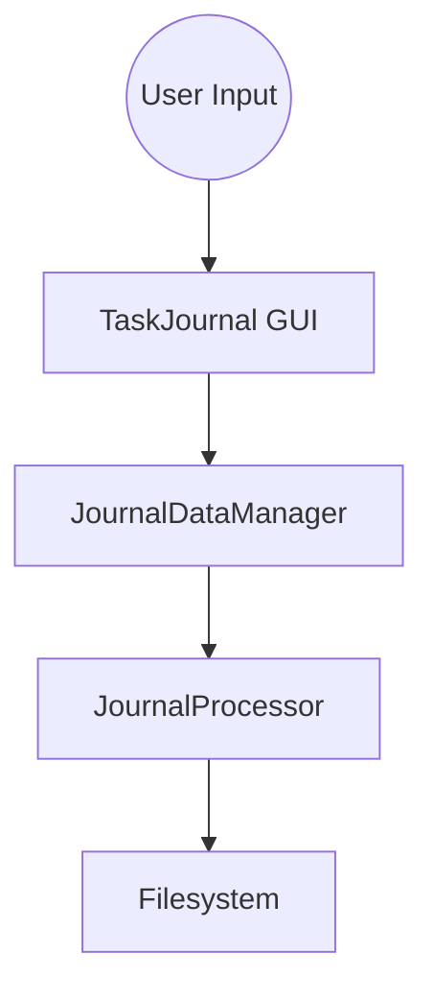
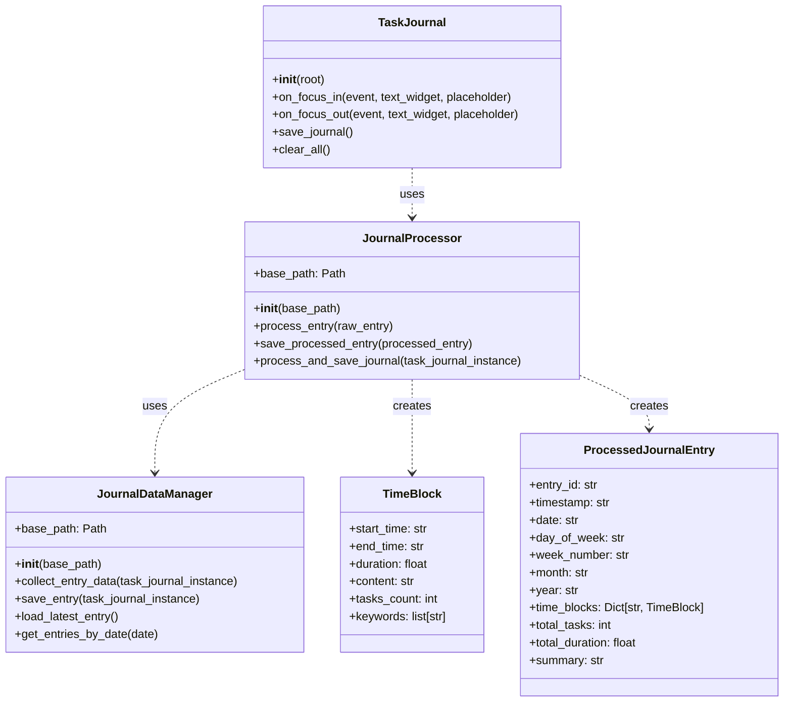
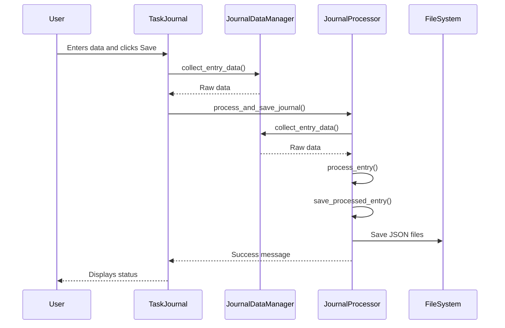

lets create a full  static analysis on this entire codebase and write a turing complete cyclic documentation of each data, models ,types, structures AND algorithms, folder structures such as modules imports..
PLEASE JUST verbose a complete codebase thecnical documentation by explaining th big picture by indexing modules/ data workflows > algorithms > data structures ... Etc by explaning AALL OF CODE FUNCTIONING by diagrams UML relational minmaps, mermaid... etc

1 - @pseudo_processing_code.txt  > 

2 - @journal_data_manager.py  >

3 - @journal_processor.py > 

4 - @task_journal.py  >

5 - @src - @main.py  > 

lets enhace a performance ananalytics @docs_workflow.md  of each function, params OF frameworks and imports IN this entire code base to enhance deeper understanding of de cycle of data processing until local saving.. how this data are slipted at local memory execution of widgts; inputs ... and how the "save_button" are trigged to tocal saving... please describe the entire code runtime by each line classified by data models .... Diagrams, UML , Mermaid and such as any MD render abstract diagram representation of any aspect of this code review!!!!!

# Technical Analysis and Documentation

## Data Flow Diagrams



## Performance Analytics

### Function and Parameter Analysis

#### JournalDataManager.collect_entry_data(task_journal_instance)
- **Purpose**: Collects user input from the GUI.
- **Parameters**: `task_journal_instance`: Instance of TaskJournal containing GUI elements.
- **Performance**: Could be optimized by caching widget references. Potential bottleneck if GUI complexity increases.

#### JournalProcessor.process_entry(raw_entry)
- **Purpose**: Processes raw collected data into structured format.
- **Parameters**: `raw_entry`: Dictionary of raw data.
- **Performance**: Efficient for current data size. Keyword extraction is basic; integrating NLP libraries could impact performance.

#### JournalProcessor.save_processed_entry(processed_entry)
- **Purpose**: Saves processed data to JSON files in multiple folders.
- **Parameters**: `processed_entry`: Instance of ProcessedJournalEntry.
- **Performance**: Multiple file writes; consider threading or async IO for large datasets. Directory creation is done per save; caching existing paths could improve speed.

## Frameworks and Imports

- **tkinter**: Standard GUI library in Python; adequate for simple interfaces.
- **dataclasses**: Introduced in Python 3.7; provides an efficient way to create data classes.
- **json**: Used for serialization; performance is acceptable for current use case.
- **os & pathlib**: Used for filesystem interactions; pathlib offers an object-oriented approach.


 # 1 - @pseudo_processing_code.txt  >

The provided Python code creates a folder structure for organizing logs based on a given timestamp. It generates three types of folders: daily, monthly, and weekly, using specific formatting conventions. The folders are created under a specified base path, ensuring that they exist before saving any logs.

### Step-by-Step Explanation

1. **Importing Libraries**:
   ```python
   import os
   from datetime import datetime
   ```
   - The code imports the `os` module for interacting with the operating system (specifically for file and directory operations) and the `datetime` module to handle date and time.

2. **Defining the Function**:
   ```python
   def create_folder_structure(base_path, timestamp):
   ```
   - A function named `create_folder_structure` is defined, which takes two parameters: `base_path` (the root directory where folders will be created) and `timestamp` (a string representing the date and time).

3. **Parsing the Timestamp**:
   ```python
   dt = datetime.strptime(timestamp, "%Y-%m-%d %H:%M:%S")
   ```
   - The `timestamp` string is parsed into a `datetime` object using the specified format (`"%Y-%m-%d %H:%M:%S"`). This allows easy extraction of various date components.

4. **Generating Folder Names**:
   ```python
   year = dt.year
   month_folder = f"{str(year)[-2:]}-{dt.strftime('%m')}/"
   week_number = dt.strftime("%U")  # Week number
   week_folder = f"[w]{week_number}-{dt.strftime('%m-%d')}/"
   daily_folder = f"{dt.strftime('%a-%d-%m-%y')}/"
   ```
   - The code extracts the year, month, week number, and day from the `datetime` object:
     - `month_folder`: Formatted as `YY-MM/` (e.g., `24-12/`).
     - `week_folder`: Formatted as `[w]ww-MM-dd/` (e.g., `[w]49-12-03/`).
     - `daily_folder`: Formatted as `ddd-DD-MM-YY/` (e.g., `Tue-03-12-24/`).

5. **Creating Full Paths**:
   ```python
   daily_path = os.path.join(base_path, "daily", daily_folder)
   monthly_path = os.path.join(base_path, "monthly", month_folder)
   weekly_path = os.path.join(base_path, "weekly", week_folder)
   ```
   - The function constructs the full paths for each type of folder (daily, monthly, weekly) by joining the `base_path` with the respective folder names.

6. **Creating Directories**:
   ```python
   for path in [daily_path, monthly_path, weekly_path]:
       os.makedirs(path, exist_ok=True)
   ```
   - The `os.makedirs()` function is used to create the directories. The `exist_ok=True` parameter ensures that no error is raised if the directory already exists.

7. **Returning Folder Paths**:
   ```python
   return {
       "daily": daily_path,
       "monthly": monthly_path,
       "weekly": weekly_path
   }
   ```
   - The function returns a dictionary containing the paths of the created daily, monthly, and weekly folders.

8. **Example Usage**:
   ```python
   base_directory = "work-logs/2024"
   timestamp_example = "2024-12-03 10:00:00"
   folders = create_folder_structure(base_directory, timestamp_example)
   print(f"Daily Folder: {folders['daily']}")
   print(f"Monthly Folder: {folders['monthly']}")
   print(f"Weekly Folder: {folders['weekly']}")
   ```
   - An example is provided to demonstrate how to use the function. It sets a base directory and a timestamp, calls the function, and prints the paths of the created folders.

# Technical Analysis and Documentation

## UML Class Diagrams




### Conclusion

This code serves as a foundational tool for organizing log files into a structured folder hierarchy based on timestamps, making it easier to manage and retrieve logs efficiently. If you have any further questions or need enhancements, feel free to ask!


 # 2 - @journal_data_manager.py  > 

The provided code defines a `JournalDataManager` class that manages journal entries for a task journal application. It allows users to save and load journal entries organized by date and time in a structured folder hierarchy. Each entry is saved as a JSON file, and the class provides methods to collect entry data, save the data, load the latest entry, and retrieve entries for a specific date.

### Step-by-Step Explanation

1. **Imports**:
    - The code imports necessary libraries: `json` for handling JSON data, `os` for interacting with the operating system, `datetime` for managing date and time, `Path` from `pathlib` for file path manipulations, and typing modules for type hints.

2. **Class Definition**:
    - The `JournalDataManager` class is defined to encapsulate the functionality for managing journal entries.

3. **Initialization (`__init__` method)**:
    - The constructor takes an optional `base_path` argument (defaulting to `"journal_entries"`), which specifies where to save the journal entries.
    - It converts the `base_path` to a `Path` object and calls the `_ensure_base_directory` method to ensure that the base directory exists.

4. **Base Directory Creation (`_ensure_base_directory` method)**:
    - This private method creates the base directory specified by `base_path` if it does not already exist. It uses `mkdir` with `parents=True` to create any necessary parent directories.

5. **Timestamp Folder Creation (`_create_timestamp_folders` method)**:
    - This private method generates a folder structure based on the current date and time:
        - Year and month are formatted as `YY-MM`.
        - Week is formatted as `wWW-MM-DD`.
        - Day is formatted as `DDD-DD-MM-YY`.
    - It creates the complete path and ensures that all necessary folders exist before returning the path.

6. **Collecting Entry Data (`collect_entry_data` method)**:
    - This method collects data from a `task_journal_instance`, which is expected to have a specific structure with time blocks.
    - It initializes a dictionary `entry_data` with a timestamp and an empty dictionary for time blocks.
    - It iterates through each time block, retrieves the corresponding widget from the GUI, and extracts the start time, end time, and content. It handles placeholders in the text area.
    - Finally, it returns the collected `entry_data`.

7. **Saving Entry (`save_entry` method)**:
    - This method saves the collected journal entry data to a JSON file.
    - It first calls `collect_entry_data` to get the entry data.
    - Then, it creates the timestamp-based folder structure using `_create_timestamp_folders`.
    - It constructs a filename using the current time and saves the JSON data to the specified file path.
    - It returns a success status and a message indicating the result.

8. **Loading the Latest Entry (`load_latest_entry` method)**:
    - This method retrieves the most recent journal entry by searching through all JSON files in the base path.
    - It keeps track of the latest file based on modification time and reads the content of the latest file, returning it as a dictionary.
    - If an error occurs, it prints an error message and returns an empty dictionary.

9. **Retrieving Entries by Date (`get_entries_by_date` method)**:
    - This method retrieves all journal entries for a specific date.
    - It constructs the path for the specified date and checks if the path exists.
    - If it does, it loads all JSON files from that path, appending their contents to a list, which it returns.
    - It also handles any errors that may occur during this process.


### Saving a Journal Entry




### Conclusion

The `JournalDataManager` class is a well-structured way to manage journal entries, allowing for organized storage and retrieval based on time. It encapsulates functionality for creating directories, collecting data from a GUI, and saving/loading entries, making it a useful component for a task journal application.

 
 # 3 - @journal_processor.py >

The provided code defines a `JournalProcessor` class that processes raw journal entries, organizes them into structured data, and saves them into a predefined folder structure based on the current year, month, and week. The processing includes calculating durations of time blocks, extracting keywords, counting tasks, and generating summaries. The processed entries are then saved as JSON files in specific directories.

### Step-by-Step Explanation

1. **Imports**: The code imports necessary libraries:
   - `json` for handling JSON data.
   - `os` for operating system functionalities.
   - `datetime` for date and time manipulations.
   - `Path` from `pathlib` for handling file paths.
   - `Dict`, `Any`, `Optional` for type hinting.
   - `dataclass` and `asdict` for creating data classes.
   - `JournalDataManager` presumably for managing journal data.

2. **Data Classes**:
   - `TimeBlock`: Represents a block of time with attributes like start time, end time, duration, content, task count, and keywords.
   - `ProcessedJournalEntry`: Represents a processed journal entry with various attributes including entry ID, timestamp, date, day of the week, and time blocks.

3. **JournalProcessor Class**:
   - The `__init__` method initializes the processor with a base path and a `JournalDataManager` instance. It also ensures the folder structure is created for organizing journal entries.

4. **Folder Structure Creation**:
   - `_ensure_folder_structure`: Creates directories for daily, weekly, and monthly logs under the current year if they do not exist.

5. **Duration Calculation**:
   - `_calculate_duration`: Takes start and end times as strings, calculates the duration in hours, and returns it. If the input format is incorrect, it returns 0.0.

6. **Keyword Extraction**:
   - `_extract_keywords`: Extracts keywords from the content by splitting it into words, filtering out common words, and returning up to five unique keywords.

7. **Task Counting**:
   - `_count_tasks`: Counts the number of tasks in the content, assuming tasks are separated by newlines.

8. **Summary Generation**:
   - `_generate_summary`: Creates a summary of the journal entry by calculating the total number of tasks and total duration across all time blocks.

9. **Processing Journal Entry**:
   - `process_entry`: Takes a raw journal entry, processes each time block to calculate duration, count tasks, and extract keywords. It then creates a `ProcessedJournalEntry` object with all the relevant information.

10. **Saving Processed Entry**:
    - `save_processed_entry`: Saves the processed journal entry into JSON files in the appropriate daily, weekly, and monthly directories. It creates the necessary directories if they do not exist.

11. **Main Processing Method**:
    - `process_and_save_journal`: This method orchestrates the entire process. It fetches a raw journal entry from the `JournalDataManager`, processes it, and saves it. It handles exceptions and returns success status and messages.

### Conclusion

The `JournalProcessor` class effectively structures and saves journal entries by organizing them into time blocks, calculating relevant metrics, and storing them in a systematic folder structure. This makes it easier to manage and retrieve journal data over time.


 # 4 - @task_journal.py  >
The provided code creates a graphical user interface (GUI) for a "Daily Task Journal" application using the `tkinter` library in Python. The application allows users to log tasks for different times of the day (morning, mid-day, evening), enter start and end times for each task, and save or clear their journal entries. The interface is styled with a dark theme, and it includes a status bar to display messages to the user.

### Step-by-Step Explanation

1. **Imports:**
   ```python
   import tkinter as tk
   from tkinter import ttk
   from datetime import datetime
   from journal_processor import JournalProcessor
   ```
   - The code imports necessary libraries: `tkinter` for GUI elements, `ttk` for themed widgets, `datetime` for handling date and time, and a custom module `JournalProcessor` for processing and saving journal entries.

2. **Class Definition:**
   ```python
   class TaskJournal:
   ```
   - A class `TaskJournal` is defined to encapsulate the functionality of the journal application.

3. **Initialization:**
   ```python
   def __init__(self, root):
   ```
   - The `__init__` method initializes the application. It takes `root` (the main window) as an argument.

4. **Window Configuration:**
   ```python
   self.root.title("✍️ Daily Task Journal")
   self.root.geometry("680x930")
   self.root.configure(bg='#1a1a2e')
   ```
   - The title, size, and background color of the main window are set.

5. **Style Configuration:**
   ```python
   self.style = ttk.Style()
   self.style.theme_use('clam')
   ```
   - A style object is created and a theme is applied to ensure consistent styling across widgets.

6. **Widget Styling:**
   - Various widgets (frames, labels, buttons) are styled with colors and fonts to match a dark theme:
   ```python
   self.style.configure('TFrame', background='#1a1a2e')
   self.style.configure('TButton', font=('Helvetica', 11), padding=10, background='#4a4e69', foreground='#ffffff')
   ```

7. **Canvas and Scrollbar:**
   ```python
   self.canvas = tk.Canvas(root, bg='#1a1a2e', highlightthickness=0)
   scrollbar = ttk.Scrollbar(root, orient="vertical", command=self.canvas.yview)
   ```
   - A canvas is created to hold the main content, and a vertical scrollbar is added for scrolling through the tasks.

8. **Container Setup:**
   ```python
   container = ttk.Frame(self.canvas, padding="20")
   self.canvas.create_window((0, 0), window=container, anchor="nw")
   ```
   - A frame (`container`) is created to hold various elements, and it's added to the canvas.

9. **Header Creation:**
   ```python
   header = ttk.Label(container, text="Daily Productivity Journal", style='Header.TLabel')
   header.grid(row=0, column=0, pady=(0, 10))
   ```
   - A header label is created and placed at the top of the container.

10. **Button Frame:**
    ```python
    btn_frame = ttk.Frame(container)
    save_btn = ttk.Button(btn_frame, text="💾 Save Journal", command=self.save_journal)
    clear_btn = ttk.Button(btn_frame, text="🗑️ Clear All", command=self.clear_all)
    ```
    - A frame for buttons is created, and two buttons ("Save Journal" and "Clear All") are added with their respective command functions.

11. **Time Blocks Setup:**
    ```python
    self.time_blocks = [
        ("🌅 Morning Tasks", 2, '#16213e'), 
        ("☀️ Mid-day Tasks", 3, '#1b2430'), 
        ("🌙 Evening Tasks", 4, '#1f1d36')
    ]
    ```
    - A list of time blocks is defined, each with a label and a corresponding color.

12. **Entry Widgets for Time:**
    - For each time block, entry fields for start and end times are created:
    ```python
    start_time = ttk.Entry(time_frame, width=10, font=('Helvetica', 10), style='Dark.TEntry')
    end_time = ttk.Entry(time_frame, width=10, font=('Helvetica', 10), style='Dark.TEntry')
    ```

13. **Text Area for Task Entry:**
    ```python
    text_area = tk.Text(frame, height=8, width=70, bg=color, fg='#e6e6e6')
    ```
    - A text area is created for users to enter their tasks, with placeholder text.

14. **Focus Event Handlers:**
    ```python
    text_area.bind('<FocusIn>', lambda e, t=text_area, p=placeholder: self.on_focus_in(e, t, p))
    text_area.bind('<FocusOut>', lambda e, t=text_area, p=placeholder: self.on_focus_out(e, t, p))
    ```
    - Event handlers are set up to manage placeholder text when the text area gains or loses focus.

15. **Status Bar:**
    ```python
    self.status_var = tk.StringVar()
    status_bar = ttk.Label(container, textvariable=self.status_var)
    self.status_var.set("Ready to record your day! ✨")
    ```
    - A status bar is created to provide feedback to the user.

16. **Processor Initialization:**
    ```python
    self.processor = JournalProcessor()
    ```
    - An instance of `JournalProcessor` is created to handle the processing and saving of journal entries.

17. **Focus In/Out Methods:**
    - These methods handle the behavior of the text area when it gains or loses focus, ensuring placeholder text is managed correctly.

18. **Save and Clear Methods:**
    - `save_journal` processes and saves the journal entries, updating the status bar with success or failure messages.
    - `clear_all` clears all text areas and updates the status bar accordingly.

19. **Main Loop:**
    ```python
    if __name__ == "__main__":
        root = tk.Tk()
        app = TaskJournal(root)
        root.mainloop()
    ```
    - The application is instantiated and the main loop is started, allowing the GUI to run and respond to user interactions.

This code effectively creates a well-structured and visually appealing task journal application that allows users to record and manage their daily tasks efficiently.

5 - @src - @main.py  > 
### Summary of the Code

The provided code is a main module for a task management application that includes core functionalities such as processing data, validating input, creating tasks, and retrieving pending tasks. It utilizes logging for tracking operations and employs data processing and formatting utilities. The module is designed to handle incoming data, validate it against specific criteria, create task instances, and filter pending tasks effectively.

### Step-by-Step Explanation

1. **Imports and Logging Configuration**:
   - The code begins by importing necessary libraries and modules, including `logging`, `uuid`, `json`, and datetime utilities.
   - It sets up logging configuration to capture and display log messages with timestamps, which helps in debugging and monitoring the application.

2. **`process_data` Function**:
   - This function processes incoming data.
   - It expects a dictionary as input and raises a `ValueError` if the input is invalid.
   - It initializes a `DataProcessor` and an `OutputFormatter`.
   - It processes the input data using the `DataProcessor` and checks if processing was successful.
   - If successful, it constructs a result dictionary containing a unique ID, a timestamp, the processed data, a success status, and metadata about processing statistics.
   - The result is then formatted into JSON using `OutputFormatter`.
   - If any error occurs during processing, it logs the error and returns a formatted error response.

3. **`validate_input` Function**:
   - This function validates a list of dictionaries against a required schema.
   - It checks if the input is a list and iterates through each item to confirm it is a dictionary.
   - It verifies that required fields (`title` and `description`) are present in each item.
   - It also validates the format of the `due_date` if it exists, using a helper function.
   - It returns a boolean indicating whether the input is valid and a list of error messages if applicable.

4. **`create_task` Function**:
   - This function is responsible for creating a new task.
   - It takes a title, description, optional due date, and priority level as arguments.
   - It logs the creation of the task and returns a new instance of the `Task` class initialized with the provided attributes.

5. **`get_pending_tasks` Function**:
   - This function filters and returns a list of tasks that are pending (not completed).
   - It takes a list of `Task` objects and uses a list comprehension to filter out completed tasks.

### Conclusion

